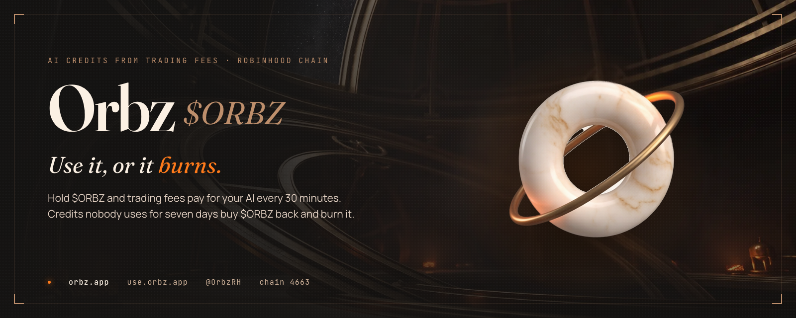
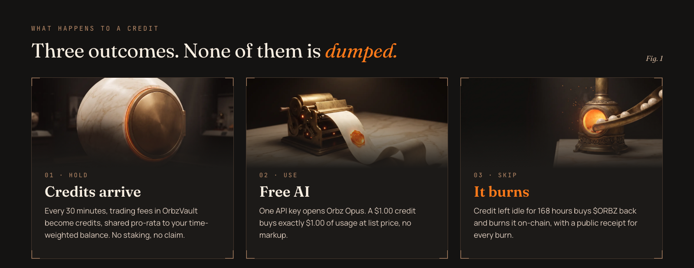
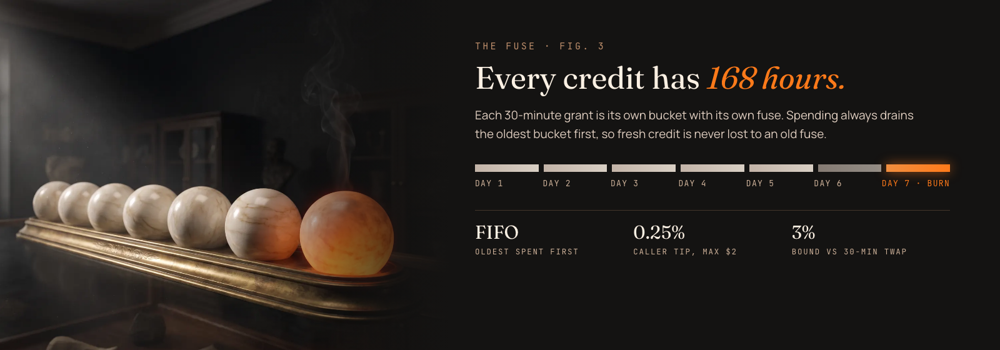
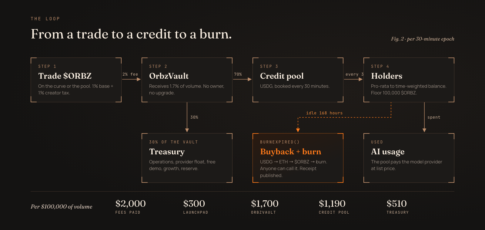
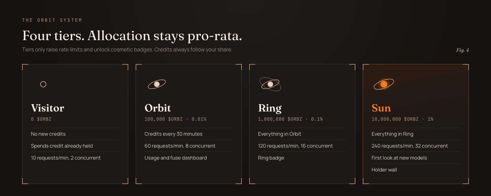
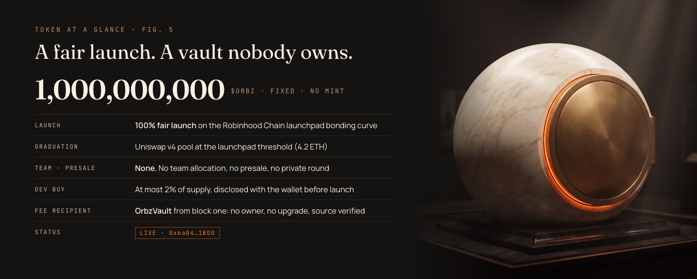
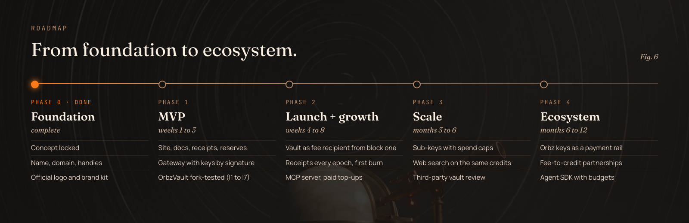

 

**[orbz.app](https://orbz.app)** · **[use.orbz.app](https://use.orbz.app)** · [Docs](https://orbz.app/docs) · [API](https://api.orbz.app/v1) · [Receipts](https://orbz.app/receipts) · [X @OrbzRH](https://x.com/OrbzRH) · [GitHub](https://github.com/OrbzRH)

---

## What is Orbz

Every 30 minutes, $ORBZ trading fees become AI credits for holders, spendable on **Orbz Opus** with one API key. Credits
idle for seven days are swapped into $ORBZ and burned on-chain, with a public receipt for each burn. A holder who codes
all day gets free AI. A holder who never opens the app still gains, because every idle credit becomes a
buyback-and-burn.

The first fee-to-credit tokens proved the demand and exposed the flaw: an incumbent's own public analytics show only
13% to 18% of the credit it issued was ever spent on inference, and the rest was sold below face value. Orbz sends that
idle majority into the burn.

- **One token, zero setup.** Hold it and credits arrive. No staking, no second token, no order book.
- **Idle value becomes buy pressure.** Unused credit buys and burns $ORBZ instead of being dumped.
- **Provable reserves.** Every credit in every dashboard is backed one to one by USDG in an ownerless vault.
- **Nobody can stall a burn.** `burnExpired()` is permissionless, with a caller tip.
- **List price, no markup.** A $1.00 credit buys exactly $1.00 of model usage.

## Features

| Feature | What you get |
|---|---|
| **Credits every 30 minutes** | Every epoch, the credit pool is shared out to holders above the floor, pro-rata to their time-weighted balance. No claim button, no staking. |
| **Orbz Opus** | Orbz's own model: fast and general purpose, for writing, code and analysis in any language. $0.30 in and $2.50 out per million tokens, no markup. |
| **One key** | Sign in with your wallet, mint an `sk-orbz-...` key, and point any chat-completions client at `api.orbz.app/v1` with model `orbz-opus`. Streaming supported. |
| **The fuse** | Each grant is a bucket that burns 168 hours after its epoch. Spending drains the oldest bucket first, and the dashboard shows what burns next. |
| **Playground** | Chat with Orbz Opus inside the console, billed from the same credits, capped per day. |
| **Usage and badges** | Request log, spend chart, totals per model, and badges earned from settled usage. |
| **"$0 AI bill" card** | A shareable card drawn from your real usage, on a link you can revoke. |
| **Burn receipts** | One public receipt per epoch: credit granted, spent and burned, in JSON or CSV. |
| **Reserves** | The vault's USDG checked against every outstanding credit, one to one. |
| **Safe sign-in** | A signed message, never a transaction. Keys are minted by the server and stored only as a hash; rotate or revoke them at any time. |

> **Live** at [use.orbz.app](https://use.orbz.app) since epoch 0 (2026-10-01 18:00 UTC): credits every 30 minutes for
> holders of 100,000 $ORBZ or more, Orbz Opus on one key, and unused credit bought back and burned after seven days.

## Highlights

| Mechanic | Value |
|---|---|
| Trading fee | 2% (1% launchpad base + 1% creator tax) |
| Reaches OrbzVault | 1.7% of every trade, before and after graduation |
| Vault split | 70% credit pool (USDG, booked every epoch) / 30% treasury |
| Epoch | 30 minutes, numbered from launch (epoch 0 = 2026-10-01 18:00 UTC) |
| Credit | $1.00 of model usage at list price, tied to the wallet, valid 168 hours |
| Spending order | FIFO: the oldest credit burns first, fresh credit is never lost to an old fuse |
| Share | Pro-rata to the time-weighted balance over the epoch; floor 100,000 $ORBZ |
| Burn | After 168 hours: USDG → ETH → $ORBZ → `burn()`, 0.25% caller tip capped at $2 |
| Price guard | Every swap reverts beyond 3% from a 30-minute TWAP |

## The Loop

**Per $100,000 of volume:** traders pay $2,000, the launchpad keeps $300, OrbzVault receives $1,700, the credit pool
gets $1,190 and the treasury $510. At 15% usage that is $178.50 of AI and $1,011.50 burned; at 50%, $595.00 and
$595.00; at 100%, $1,190 of AI and nothing burned. Illustrative arithmetic, not a forecast.

## Tiers

Allocation is strictly pro-rata. Tiers only raise rate limits and unlock cosmetic badges.

| Tier | Hold | Unlocks |
|---|---|---|
| Visitor | 0 | No new credits; credit already held stays spendable (10 requests/min, 2 concurrent); receipts, reserves, docs |
| Orbit | 100,000 $ORBZ (0.01%) | Credit grants every 30 minutes, 60 requests/min, 8 concurrent, usage and fuse dashboard |
| Ring | 1,000,000 $ORBZ (0.1%) | Everything in Orbit, 120 requests/min, 16 concurrent, Ring badge |
| Sun | 10,000,000 $ORBZ (1%) | Everything in Ring, 240 requests/min, 32 concurrent, first look at new models, holder wall |

## Token at a Glance

| Fact | Value |
|---|---|
| Name / ticker | Orbz / $ORBZ |
| Chain | Robinhood Chain (EVM, chainId 4663) |
| Supply | 1,000,000,000, fixed, no mint |
| Launch | 100% fair launch on the Robinhood Chain launchpad bonding curve |
| Graduation | Uniswap v4 pool at the launchpad threshold (4.2 ETH) |
| Team allocation, presale, private round | None |
| Dev buy | At most 2% of supply, disclosed with the wallet address before launch |
| Fee recipient | OrbzVault from block one: no owner, no upgrade, source verified |
| Status | **Live.** Contract address `0x6a043193D37872A958aAbbC0C7221541f5661BD0` ([explorer](https://robin.etherscan.io/token/0x6a043193D37872A958aAbbC0C7221541f5661BD0)) |

## Tech Stack

| Layer | Choice |
|---|---|
| Chain | Robinhood Chain, EVM, chainId 4663 |
| Contract | Solidity 0.8.37, Foundry, mainnet-fork invariant tests |
| Stablecoin | USDG (6 decimals) |
| Web | Next.js 16, React 19, Tailwind 4, viem |
| API | Chat-completions compatible gateway, integer micro-dollar metering |
| Workers | Node 22, TypeScript, viem, Postgres 17 |
| Client | Python 3.10+ (`orbz`), OpenAPI 3.1 |

## Roadmap

| Phase | Window | Scope |
|---|---|---|
| 0 · Foundation | done | Concept locked; name, domain and handle chosen; official logo and brand kit |
| 1 · MVP | weeks 1 to 3 | Landing page with docs, receipts and reserves; gateway with keys by signature and FIFO grants; indexer and allocator on a mainnet fork; OrbzVault fork-tested against I1 to I7; keeper and publisher; demo chat |
| 2 · Launch + growth | weeks 4 to 8 | Vault as fee recipient from block one; per-epoch receipts and first-burn countdown; "$0 AI bill" cards, Free-AI board, Ember wall; MCP server; paid top-ups for non-holders (5% margin burns); weekly public report |
| 3 · Scale | months 3 to 6 | Sub-keys with spend caps; web search and scraping on the same credits; redundant upstream providers; third-party review of OrbzVault; usage-root verifier |
| 4 · Ecosystem | months 6 to 12 | Orbz keys as a payment rail; fee-to-credit partnerships with Robinhood Chain projects; agent SDK with budget planning; governance of the next vault's parameters |

## Reference Links

| Resource | Link |
|---|---|
| Website | [orbz.app](https://orbz.app) |
| App | [use.orbz.app](https://use.orbz.app) |
| API | `https://api.orbz.app/v1` |
| Docs | [orbz.app/docs](https://orbz.app/docs) |
| Receipts | [orbz.app/receipts](https://orbz.app/receipts) |
| Reserves | [orbz.app/reserves](https://orbz.app/reserves) |
| X | [@OrbzRH](https://x.com/OrbzRH) |
| GitHub | [github.com/OrbzRH](https://github.com/OrbzRH) |
| Explorer | [robin.etherscan.io](https://robin.etherscan.io) |

## Scam Warning

> [!WARNING]
> **The only $ORBZ contract address is `0x6a043193D37872A958aAbbC0C7221541f5661BD0`.** Any other address is fake.
>
> - There is **no presale, no private round and no whitelist**. Anyone offering one is running a scam.
> - The official contract address is shown on [orbz.app](https://orbz.app) and on [@OrbzRH](https://x.com/OrbzRH).
>   Check every character before you buy.
> - Orbz never sends direct messages first, never asks for a seed phrase or private key, and never asks you to sign
>   anything outside [use.orbz.app](https://use.orbz.app). Signing in there is a message, never a transaction.
> - Anything from a stranger is a scam. When in doubt, go to orbz.app yourself.

---

Orbz credits are a grant of product access to AI model usage. They are not transferable, not redeemable for cash or any
digital asset, and not an investment return. Credit amounts depend on trading activity and are never fixed or promised.
$ORBZ is a utility token for access within the product; it confers no ownership, profit share or claim on any entity or
asset. Burns are a protocol mechanism, not a payment to holders. Nothing here is financial, investment, legal or tax
advice. Smart contracts can contain bugs; model providers can change prices or access. Digital assets are volatile.
Never risk funds you cannot afford to lose.

